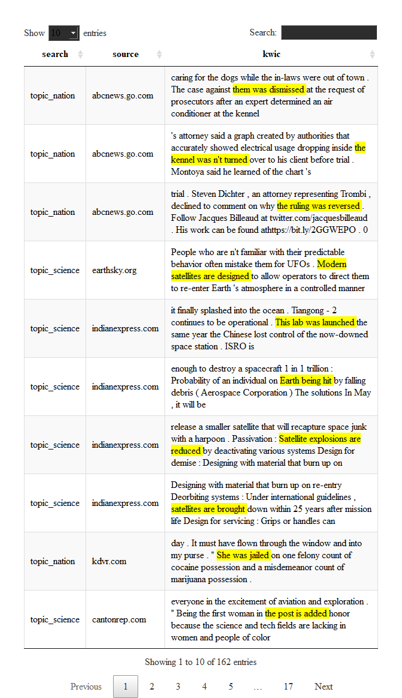

corpuslingr: some corpus linguistics in r
-----------------------------------------

A library of functions that streamlines two sets of common text-corpus tasks:

-   annotated corpus search of grammatical constructions and complex lexical patterns in context, and
-   detailed summary and aggregation of corpus search results.

### search

Grammatical constructions and complex lexical patterns are formalized here (in terms of an annotated corpus) as patterns comprised of:

-   different types of elements (eg, form, lemma, or part-of-speech),
-   contiguous and/or non-contiguous elements,
-   positionally fixed and/or free (ie, optional) elements, or
-   any combination thereof.

Under the hood, `corpuslingr` search is regex-based & (informally) tuple-based --- akin to the `RegexpParser` function in Python's Natural Language Toolkit (NLTK). Regex character matching is streamlined with a simple "corpus querying language" modeled after the more intuitive and transparent syntax used in the online BYU suite of English corpora. This allows for convenient specification of search patterns comprised of form, lemma, & pos, with all of the functionality of regex metacharacters and repetition quantifiers.

At present, part-of-speech search is based on **English-specific** part-of-speech tags. In theory, search functionality could be made more language-generic by utilizing universal part-of-speech tags when building tuples. However, language-specific search will utlimately be more powerful/insightful.

### summary

Summary functions allow users to:

-   aggregate search results by text & token frequency,
-   view search results in context (kwic),
-   create word embeddings/co-occurrence vectors for each search term, and
-   specify how search results are aggregated.

Importantly, both search and aggregation functions can be easily applied to multiple (ie, any number of) search queries.

### utility

While still in development, the package should be useful to linguists and digital humanists interested in having [BYU corpora](https://corpus.byu.edu/)-like search & summary functionality when working with (moderately-sized) personal corpora, as well as researchers interested in performing finer-grained, more qualitative analyses of language use and variation in context.

------------------------------------------------------------------------

Here, we walk through a simple workflow from corpus creation using `quicknews`, corpus annotation using the `cleanNLP` package, and annotated corpus search & summary using `corpuslingr`.

``` r
library(tidyverse)
library(cleanNLP)
library(corpuslingr) #devtools::install_github("jaytimm/corpuslingr")
library(quicknews) #devtools::install_github("jaytimm/quicknews")
library(DT)
```

------------------------------------------------------------------------

Corpus preparation & annotation
-------------------------------

To demo the search functionality of `corpuslingr`, we first build a small corpus of current news articles using my `quicknews` package. We apply the `gnews_get_meta`/`gnews_scrape_web` functions across multiple Google News sections to build out the corpus some, and to add a genre-like dimension to the corpus.

``` r
topics <- c('nation','world', 'sports', 'science')

corpus <- lapply(topics, function (x) {
    quicknews::qnews_get_meta (language="en", country="us", type="topic", search=x)})%>%
  bind_rows() %>%
  quicknews::qnews_scrape_web ()
```

------------------------------------------------------------------------

### clr\_prep\_corpus

This function performs two tasks. It eliminates unnecessary whitespace from the text column of a corpus data frame object. Additionally, it attempts to trick annotators into treating hyphenated words as a single token. With the exception of Stanford's CoreNLP (via `cleanNLP`), annotators tend to treat hyphenated words as multiple word tokens. For linguists interested in word formation processes, eg, this is disappointing. There is likely a less hacky way to do this.

``` r
corpus <- clr_prep_corpus (corpus, hyphenate = TRUE)
```

------------------------------------------------------------------------

### Annotate via cleanNLP and udpipe

For demo purposes, we use `udpipe` (via `cleanNLP`) to annotate the corpus data frame object.

``` r
cleanNLP::cnlp_init_udpipe(model_name="english",feature_flag = FALSE, parser = "none") 
ann_corpus <- cleanNLP::cnlp_annotate(corpus$text, as_strings = TRUE, doc_ids = corpus$doc_id) 
```

------------------------------------------------------------------------

### clr\_set\_corpus()

This function prepares the annotated corpus for complex search (as defined above) by building `<token~lemma~pos>` tuples and setting tuple onsets/offsets. Additionally, column names are homogenized using the naming conventions established in the `spacyr` package. Lastly, the function splits the corpus into a list of data frames by document. This is ultimately a search convenience.

Including text metadata in the `meta` parameter enables access to (and aggregation by) text characteristics included in metadata in the process of corpus search.

``` r
lingr_corpus <- ann_corpus$token %>%
  clr_set_corpus(doc_var='id', 
                  token_var='word', 
                  lemma_var='lemma', 
                  tag_var='pos', 
                  pos_var='upos',
                  sentence_var='sid',
                  meta = corpus[,c('doc_id','source','search')]) 
```

Some example tuple-ized text:

``` r
paste(lingr_corpus$corpus[[1]]$tup[200:204], collapse= " ")
## [1] "<against~against~IN> <him~he~PRP> <in~in~IN> <the~the~DT> <deaths~death~NNS>"
```

------------------------------------------------------------------------

### clr\_desc\_corpus()

A simple function for describing an annotated corpus, providing some basic aggregate statistics at the corpus, genre, and text levels.

``` r
summary <- corpuslingr::clr_desc_corpus(lingr_corpus,doc="doc_id", 
                        sent="sentence_id", tok="token",upos='pos', genre="search")
```

-   **Corpus summary:**

``` r
summary$corpus
##    n_docs textLength textType textSent
## 1:     63      43489     7618     2015
```

-   **By genre:**

``` r
summary$genre
##           search n_docs textLength textType textSent
## 1:  topic_nation     18      10644     2824      542
## 2:  topic_sports     17       9620     2249      476
## 3:   topic_world     16      14466     3414      687
## 4: topic_science     12       8759     2484      365
```

-   **By text:**

``` r
head(summary$text)
##    doc_id textLength textType textSent
## 1:      1        712      311       38
## 2:      2        190      131       10
## 3:      3        150       98        8
## 4:      4        370      191       22
## 5:      5        686      333       33
## 6:      6       1682      457      117
```

------------------------------------------------------------------------

Search & aggregation functions
------------------------------

### Basic search syntax

The search syntax utilized here is modeled after the syntax implemented in the [BYU suite of corpora](https://corpus.byu.edu/). A full list of part-of-speech syntax can be viewed [here](https://github.com/jaytimm/corpuslingr/blob/master/data-raw/clr_ref_pos_syntax.csv).

``` r
library(knitr)
corpuslingr::clr_ref_search_egs %>% kable(escape=FALSE, format = "html")
```

<table>
<thead>
<tr>
<th style="text-align:left;">
type
</th>
<th style="text-align:left;">
search\_syntax
</th>
<th style="text-align:left;">
example
</th>
</tr>
</thead>
<tbody>
<tr>
<td style="text-align:left;">
Simple form search
</td>
<td style="text-align:left;">
lime
</td>
<td style="text-align:left;">
lime
</td>
</tr>
<tr>
<td style="text-align:left;">
Simple lemma search
</td>
<td style="text-align:left;">
DRINK
</td>
<td style="text-align:left;">
drinks, drank, drinking
</td>
</tr>
<tr>
<td style="text-align:left;">
Lemma with POS search
</td>
<td style="text-align:left;">
BARK~VERB
</td>
<td style="text-align:left;">
barked, barking
</td>
</tr>
<tr>
<td style="text-align:left;">
Simple phrasal search
</td>
<td style="text-align:left;">
in the long run
</td>
<td style="text-align:left;">
in the long run
</td>
</tr>
<tr>
<td style="text-align:left;">
Phrasal search - POS/form
</td>
<td style="text-align:left;">
ADJ and ADJ
</td>
<td style="text-align:left;">
happy and healthy, political and economical
</td>
</tr>
<tr>
<td style="text-align:left;">
Phrasal search inc noun phrase
</td>
<td style="text-align:left;">
VERB NPHR into VBG
</td>
<td style="text-align:left;">
trick someone into believing
</td>
</tr>
<tr>
<td style="text-align:left;">
Phrasal search inc noun phrase
</td>
<td style="text-align:left;">
VERB PRP$ way PREP NPHR
</td>
<td style="text-align:left;">
make its way through the Senate
</td>
</tr>
<tr>
<td style="text-align:left;">
Suffix search
</td>
<td style="text-align:left;">
\*tion
</td>
<td style="text-align:left;">
defenestration, nation, retaliation
</td>
</tr>
<tr>
<td style="text-align:left;">
Infix search
</td>
<td style="text-align:left;">
\*break\*
</td>
<td style="text-align:left;">
breakable, heartbreaking
</td>
</tr>
<tr>
<td style="text-align:left;">
Optional search w/ parens and ?
</td>
<td style="text-align:left;">
MD (NEG)? HAVE been
</td>
<td style="text-align:left;">
should have been, might not have been
</td>
</tr>
<tr>
<td style="text-align:left;">
Multiple term search w parens and |
</td>
<td style="text-align:left;">
PRON (HOPE| WISH| DESIRE)
</td>
<td style="text-align:left;">
He hoped, they wish
</td>
</tr>
<tr>
<td style="text-align:left;">
Multiple term search w parens and |
</td>
<td style="text-align:left;">
House (Republicans| Democrats)
</td>
<td style="text-align:left;">
House Republicans, House Democrats
</td>
</tr>
<tr>
<td style="text-align:left;">
Indeterminate wildcard search w brackets and min/max
</td>
<td style="text-align:left;">
NPHR BE \*{1,4} ADJ
</td>
<td style="text-align:left;">
He was very, very happy; I'm not sure
</td>
</tr>
</tbody>
</table>

------------------------------------------------------------------------

### clr\_search\_gramx()

Search for all instantiations of a particular lexical pattern/grammatical construction devoid of context. This function enables fairly quick search. By setting `include_meta = TRUE`, search results can be viewed with text metadata.

``` r
search1 <- "ADJ and (ADV)? ADJ"

lingr_corpus %>%
  corpuslingr::clr_search_gramx(search=search1, include_meta=TRUE)%>%
  select(doc_id, source, token, tag)%>% 
  slice(1:15)
## # A tibble: 15 x 4
##    doc_id source                        token                        tag  
##    <chr>  <chr>                         <chr>                        <chr>
##  1 4      fox6now.com                   used and uncapped            JJ C~
##  2 8      profootballtalk.nbcsports.com second and final             JJ C~
##  3 8      profootballtalk.nbcsports.com more and more clear          JJR ~
##  4 9      arabnews.com                  cognitive and emotional      JJ C~
##  5 10     cantonrep.com                 digital and print            JJ C~
##  6 11     ecns.cn                       racial and ethnic            JJ C~
##  7 12     espn.com                      official and unofficial      JJ C~
##  8 14     espn.com                      healthy and strong           JJ C~
##  9 15     espn.com                      loud and cranky              JJ C~
## 10 18     foxnews.com                   daily and multiple           JJ C~
## 11 21     latimes.com                   secure and less vulnerable   JJ C~
## 12 21     latimes.com                   secure and cheap             JJ C~
## 13 21     latimes.com                   difficult and time-consuming JJ C~
## 14 23     njherald.com                  affordable and non-invasive  JJ C~
## 15 25     timesfreepress.com            armed and dangerous          JJ C~
```

------------------------------------------------------------------------

### clr\_get\_freq()

A simple function for calculating text and token frequencies of search term(s). The `agg_var` parameter allows the user to specify how frequency counts are aggregated.

``` r
search2 <- "VERB into"

lingr_corpus %>%
  corpuslingr::clr_search_gramx(search=search2)%>%
  corpuslingr::clr_get_freq(agg_var = c('lemma'), toupper=TRUE)%>%
  head()
##           lemma txtf docf
## 1:   CRASH INTO   12    2
## 2:      GO INTO    4    3
## 3:    COME INTO    2    2
## 4: RELEASE INTO    2    1
## 5:  SPLASH INTO    2    1
## 6:   BRING INTO    1    1
```

Setting `include_meta = TRUE` facilitates aggregation by variable(s) included in metadata:

``` r
search3 <- "SHOT~NOUN| BALL~NOUN| PLAY~VERB"

lingr_corpus %>%
  corpuslingr::clr_search_gramx(search=search3, include_meta=TRUE)%>%
  corpuslingr::clr_get_freq(agg_var = c('search','token','tag'), toupper=TRUE)%>%
  slice(1:15)
## # A tibble: 15 x 5
##    search       token   tag    txtf  docf
##    <chr>        <chr>   <chr> <int> <int>
##  1 topic_sports PLAY    VB        9     5
##  2 topic_sports SHOT    NN        9     2
##  3 topic_sports PLAYED  VBD       6     5
##  4 topic_sports SHOTS   NNS       5     1
##  5 topic_nation SHOT    NN        4     1
##  6 topic_sports BALL    NN        4     3
##  7 topic_sports PLAYING VBG       4     3
##  8 topic_sports PLAYED  VBN       3     3
##  9 topic_nation PLAYING VBG       2     1
## 10 topic_nation SHOTS   NNS       2     1
## 11 topic_sports PLAY    VBP       2     1
## 12 topic_sports PLAYS   VBZ       2     2
## 13 topic_world  SHOT    NN        2     2
## 14 topic_nation PLAY    VB        1     1
## 15 topic_nation PLAYS   VBZ       1     1
```

------------------------------------------------------------------------

### clr\_search\_context()

A function that returns search terms with user-specified left and right contexts (`LW` and `RW`). Output includes a list of two data frames: a `BOW` (bag-of-words) data frame object and a `KWIC` (keyword in context) data frame object.

Note that generic noun phrases can be include as a search term (regex below), and can be specified in the query using `NPHR`.

``` r
clr_ref_nounphrase
## [1] "(?:(?:DET )?(?:ADJ )*)?(?:((NOUNX )+|PRON ))"
```

``` r
search4 <- 'NPHR BE (NEG)? VBN'

found_egs <- corpuslingr::clr_search_context(search=search4,corp=lingr_corpus,LW=15, RW = 15, include_meta = TRUE)
```

------------------------------------------------------------------------

### clr\_context\_kwic()

Access `KWIC` object:

``` r
found_egs %>%
  corpuslingr::clr_context_kwic(include=c('search', 'source'))%>% #Add genre.
  DT::datatable(selection="none",class = 'cell-border stripe', rownames = FALSE,width="100%", escape=FALSE)
```



------------------------------------------------------------------------

### clr\_context\_bow()

A function for accessing/aggregating `BOW` object. The parameters `agg_var` and `content_only` can be used to specify how collocates are aggregated and whether only content words are included, respectively.

``` r
search5 <- "White House"

corpuslingr::clr_search_context(search=search5,corp=lingr_corpus, LW=20, RW=20)%>%
  corpuslingr::clr_context_bow(content_only = TRUE, agg_var = c('searchLemma', 'lemma'))%>%
  head()
##    searchLemma     lemma cofreq
## 1: WHITE HOUSE     TRUMP      6
## 2: WHITE HOUSE     KELLY      5
## 3: WHITE HOUSE      POST      3
## 4: WHITE HOUSE PRESIDENT      3
## 5: WHITE HOUSE       SAY      3
## 6: WHITE HOUSE    SUNDAY      3
```

------------------------------------------------------------------------

### clr\_search\_keyphrases()

Function for extracting key phrases from each text comprising a corpus based on tf-idf weights. The methods and logic underlying this function are described in more detail [here](https://www.jtimm.net/blog/keyphrase-extraction-from-a-corpus-of-texts/).

The regex for key phrase search:

``` r
clr_ref_keyphrase
## [1] "(ADJ )*(NOUNX )+((PREP )(ADJ )*(NOUNX )+)?"
```

The user can specify the number of key phrases to extract, how to aggregate key phrases, how to output key phrases, and whether or not to use jitter to break ties among top n key phrases.

``` r
library(knitr)
lingr_corpus %>%
  corpuslingr::clr_search_keyphrases(n=5, key_var ='lemma', flatten=TRUE,jitter=TRUE)%>%
  head()%>%
  kable(escape=FALSE, format = "html")
```

<table>
<thead>
<tr>
<th style="text-align:left;">
doc\_id
</th>
<th style="text-align:left;">
keyphrases
</th>
</tr>
</thead>
<tbody>
<tr>
<td style="text-align:left;">
1
</td>
<td style="text-align:left;">
Arpaio | attorney | dog | kennel | Austin Flake
</td>
</tr>
<tr>
<td style="text-align:left;">
2
</td>
<td style="text-align:left;">
twin boy | Getty Images Sarah Ryan | rest Jan | Comment Bubble Icon Patrick Smith | Falcons practice Jan
</td>
</tr>
<tr>
<td style="text-align:left;">
3
</td>
<td style="text-align:left;">
male suspect | news | incident | scene | outside agency
</td>
</tr>
<tr>
<td style="text-align:left;">
4
</td>
<td style="text-align:left;">
baby | street | police | boyfriend | old food
</td>
</tr>
<tr>
<td style="text-align:left;">
5
</td>
<td style="text-align:left;">
ISRO | China | space station | control | low-earth orbit
</td>
</tr>
<tr>
<td style="text-align:left;">
6
</td>
<td style="text-align:left;">
GMT | pm | tree | police | car
</td>
</tr>
</tbody>
</table>
