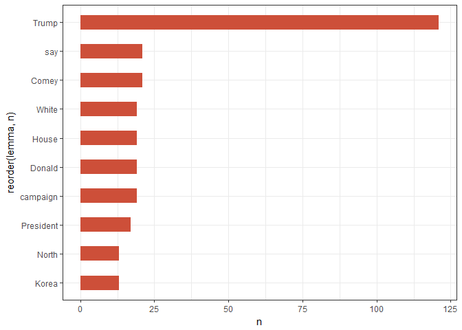

corpuslingr
===========

The main function of this library is to enable complex search of an annotated corpus akin to search functionality made available via `RegexpParser` in Python's Natural Language Toolkit (NLTK). While regex-based, search syntax has been simplified, and modeled after the more intuitive syntax used in the online BYU suite of corpora.

Summary functions allow users to aggregate search results by text & token frequency, view search results in context (kwic), and create word embeddings/co-occurrence vectors for each search term. Functions also allow users to specify how search results are aggregated. Importantly, search and aggregation functions can be easily applied to multiple (ie, any number of) search queries.

The collection of functions presented here is ideal for usage-based linguists and digital humanists interested in fine-grained search of moderately-sized corpora.

``` r
library(tidyverse)
library(cleanNLP)
library(corpuslingr) #devtools::install_github("jaytimm/corpuslingr")
library(quicknews) #devtools::install_github("jaytimm/quicknews")
library(DT)
```

Here, we walk through a simple workflow from corpus creation using `quicknews`, corpus annotation using the `cleanNLP` package, and annotated corpus search using `corpuslingr`.

------------------------------------------------------------------------

Corpus preparation & annotation
-------------------------------

To demo the search functionality of `corpuslingr`, we first build a small corpus of current news articles using my `quicknews` package. We apply the `gnews_get_meta`/`gnews_scrape_web` functions across multiple Google News sections to build out the corpus some, and to add a genre-like dimension to the corpus.

``` r
topics <- c('nation','world', 'sports')

corpus <- lapply(topics, function (x) {
    quicknews::qnews_get_meta (language="en", country="us", type="topic", search=x)%>%
    quicknews::qnews_scrape_web (link_var='link')})%>%
  bind_rows() %>%
  mutate(doc_id = as.character(row_number())) #Add doc_id
```

------------------------------------------------------------------------

### clr\_prep\_corpus

This function performs two tasks. It elminates unnecessary whitespace from the text column of a corpus dataframe object. Additionally, it attempts to trick annotators into treating hyphenated words as a single token. With the exception of Stanford's CoreNLP (via `cleanNLP`), annotators tend to treat hyphenated words as multiple word tokens. For linguists interested in word formation processes, eg, this is disappointing. There is likley a less hacky way to do this.

``` r
corpus <- clr_prep_corpus (corpus, hyphenate = TRUE)
```

------------------------------------------------------------------------

### Annotate via cleanNLP and udpipe

For demo purposes, we use `udpipe` (via `cleanNLP`) to annotate the corpus dataframe object.

``` r
cleanNLP::cnlp_init_udpipe(model_name="english",feature_flag = FALSE, parser = "none") 
ann_corpus <- cleanNLP::cnlp_annotate(corpus$text, as_strings = TRUE, doc_ids = corpus$doc_id) 
```

------------------------------------------------------------------------

### clr\_set\_corpus()

This function prepares the annotated corpus for complex, tuple-based search. Tuples are created, taking the form `<token~lemma~pos>`; tuple onsets/offsets are also set.

Annotation output is homogenized, including column names. Naming conventions established in the `spacyr` package are adopted here.

Lastly, the function splits the corpus into a list of dataframes by document. This is ultimately a search convenience.

``` r
lingr_corpus <- ann_corpus$token %>%
  clr_set_corpus(doc_var='id', 
                  token_var='word', 
                  lemma_var='lemma', 
                  tag_var='pos', 
                  pos_var='upos',
                  sentence_var='sid',
                  meta = corpus[,c('doc_id','source','search')])
```

------------------------------------------------------------------------

### clr\_desc\_corpus()

A simple function for describing an annotated corpus, providing some basic aggregate statisitcs at the corpus, genre, and text levels.

``` r
summary <- corpuslingr::clr_desc_corpus(lingr_corpus,doc="doc_id", 
                        sent="sentence_id", tok="token",upos='pos', genre="search")
```

Corpus summary:

``` r
summary$corpus
##    n_docs textLength textType textSent
## 1:     52      46656     7835     1877
```

By genre:

``` r
summary$genre
##          search n_docs textLength textType textSent
## 1: topic_nation     16      14768     3739      660
## 2:  topic_world     17      16282     3560      584
## 3: topic_sports     19      15606     3261      759
```

By text:

``` r
head(summary$text)
##    doc_id textLength textType textSent
## 1:      1        402      206       16
## 2:      2       2440      899      106
## 3:      3        495      239       30
## 4:      4        572      248       29
## 5:      5        409      201       21
## 6:      6        264      165       15
```

------------------------------------------------------------------------

Search & aggregation functions
------------------------------

### Basic search syntax

The search syntax utilized here is modeled after the syntax implemented in the [BYU suite of corpora](https://corpus.byu.edu/). A full list of part-of-speech syntax can be viewed [here](https://github.com/jaytimm/corpuslingr/blob/master/data-raw/clr_ref_pos_syntax.csv).

``` r
library(knitr)
corpuslingr::clr_ref_search_egs %>%
  DT::datatable(selection="none",class = 'cell-border stripe', rownames = FALSE,width="100%", escape=FALSE)
```



``` r


#%>% kable(escape=FALSE, format = "html")
```

------------------------------------------------------------------------

### clr\_search\_gramx()

Search for all instantiaions of a particular lexical pattern/grammatical construction devoid of context. This function enables fairly quick search.

``` r
search1 <- "VERB (PRON)? (PREP| RP)"

lingr_corpus %>%
  corpuslingr::clr_search_gramx(search=search1)%>%
  slice(1:10)
## # A tibble: 10 x 4
##    doc_id token         tag    lemma      
##    <chr>  <chr>         <chr>  <chr>      
##  1 1      sentenced in  VBN IN sentence in
##  2 1      convicted for VBN IN convict for
##  3 1      according to  VBG IN accord to  
##  4 1      reported that VBD IN report that
##  5 1      caught after  VBN IN catch after
##  6 1      placed on     VBN IN place on   
##  7 1      according to  VBG IN accord to  
##  8 1      according to  VBG IN accord to  
##  9 1      amounted to   VBN IN amount to  
## 10 1      described as  VBN IN describe as
```

------------------------------------------------------------------------

### clr\_get\_freq()

A simple function for calculating text and token frequencies of search term(s). The `agg_var` parameter allows the user to specify how frequency counts are aggregated.

Note that generic noun phrases can be include as a search term (regex below), and can be specified in the query using `NPHR`.

``` r
clr_ref_nounphrase
## [1] "(?:(?:DET )?(?:ADJ )*)?(?:((NOUNX )+|PRON ))"
```

``` r
search2 <- "*tial NOUNX"

lingr_corpus %>%
  corpuslingr::clr_search_gramx(search=search2)%>%
  corpuslingr::clr_get_freq(agg_var = 'token', toupper=TRUE)%>%
  head()
##                      token txtf docf
## 1:   PRESIDENTIAL ELECTION    5    4
## 2:   PRESIDENTIAL HOPEFULS    2    1
## 3: CONFIDENTIAL SETTLEMENT    1    1
## 4:     INITIAL INTERACTION    1    1
## 5:        POTENTIAL DEPUTY    1    1
## 6:     PRESIDENTIAL PALACE    1    1
```

------------------------------------------------------------------------

### clr\_search\_context()

A function that returns search terms with user-specified left and right contexts (`LW` and `RW`). Output includes a list of two dataframes: a `BOW` (bag-of-words) dataframe object and a `KWIC` (keyword in context) dataframe object.

``` r
search3 <- 'NPHR (DO)? (NEG)? (THINK| BELIEVE )'

found_egs <- corpuslingr::clr_search_context(search=search3,corp=lingr_corpus,LW=5, RW = 5)
```

------------------------------------------------------------------------

### clr\_context\_kwic()

Access `KWIC` object:

``` r
found_egs %>%
  corpuslingr::clr_context_kwic()%>% #Add genre.
  select(doc_id,kwic)%>%
  slice(1:15)%>%
  kable(escape=FALSE, format = "markdown")
```

| doc\_id | kwic                                                                                 |
|:--------|:-------------------------------------------------------------------------------------|
| 14      | disarmament and peace . But <mark> I think </mark> it is a fact that                 |
| 15      | his law degree . " <mark> I think </mark> he needs that adrenaline rush              |
| 15      | reframing a question . " <mark> I think </mark> I 've always acted confident         |
| 16      | " This Week " that <mark> Trump believes </mark> that , on the whole                 |
| 2       | students to Washington . " <mark> I believe </mark> in what these kids are           |
| 2       | the Washington rally , said <mark> they believed </mark> that the students would not |
| 2       | gun control . " " <mark> I believe </mark> it 's their goal to                       |
| 2       | from the NRA . " <mark> They think </mark> we 're all talk and                       |
| 20      | showed a van with tinted <mark> windows believed </mark> to be carrying Puigdemo nt  |
| 24      | such a deed . " <mark> You think </mark> Prime Minister is going to                  |
| 24      | " he told ANI . <mark> You think </mark> Prime Minister is going to                  |
| 25      | health as an area where <mark> he believes </mark> Israel can become a global        |
| 34      | " Just to explain why <mark> I think </mark> coaches look at it like                 |
| 34      | was their time . So <mark> I think </mark> if you 've been there                     |
| 34      | looseness and freedom . " <mark> I do n't think </mark> it lights a fire ,           |

------------------------------------------------------------------------

### clr\_context\_bow()

A function for accessing `BOW` object. The parameters `agg_var` and `content_only` can be used to ....

``` r
search3 <- "White House"

corpuslingr::clr_search_context(search=search3,corp=lingr_corpus,LW=10, RW = 10)%>%
  corpuslingr::clr_context_bow(content_only=TRUE,agg_var=c('searchLemma','lemma'))%>%
  head()
##    searchLemma    lemma cofreq
## 1: WHITE HOUSE      SAY      7
## 2: WHITE HOUSE    COVER      6
## 3: WHITE HOUSE OFFICIAL      5
## 4: WHITE HOUSE     JOIN      4
## 5: WHITE HOUSE    TRUMP      4
## 6: WHITE HOUSE    CHIEF      3
```

------------------------------------------------------------------------

### clr\_search\_keyphrases()

Function for extracting key phrases from each text comprising a corpus based on tf-idf weights. The methods and logic underlying this function are described in more detail [here](https://www.jtimm.net/blog/keyphrase-extraction-from-a-corpus-of-texts/).

The regex for key phrase search:

``` r
clr_ref_keyphrase
## [1] "(ADJ )*(NOUNX )+((PREP )(ADJ )*(NOUNX )+)?"
```

The user can specify the number of keyphrases to extract, how to aggregate key phrases, how to output key phrases, and whether or not to use jitter to break ties among top n key phrases.

``` r
lingr_corpus %>%
  corpuslingr::clr_search_keyphrases(n=5, key_var ='lemma', flatten=TRUE,jitter=TRUE)%>%
  head()%>%
  kable(escape=FALSE, format = "html")
```

<table>
<thead>
<tr>
<th style="text-align:left;">
doc\_id
</th>
<th style="text-align:left;">
keyphrases
</th>
</tr>
</thead>
<tbody>
<tr>
<td style="text-align:left;">
1
</td>
<td style="text-align:left;">
Turley | Harris County District Attorney | Houston Chronicle | year in prison | officer
</td>
</tr>
<tr>
<td style="text-align:left;">
10
</td>
<td style="text-align:left;">
family | Sharps | Harris | Weland | son
</td>
</tr>
<tr>
<td style="text-align:left;">
11
</td>
<td style="text-align:left;">
Mr. Trump | bill | Democrats | measure | president
</td>
</tr>
<tr>
<td style="text-align:left;">
12
</td>
<td style="text-align:left;">
study | people on active duty | readiness | transgender service member | new policy
</td>
</tr>
<tr>
<td style="text-align:left;">
13
</td>
<td style="text-align:left;">
Mr. Trump | Mr. Ruddy | president | lawyer | interview on Sunday evening
</td>
</tr>
<tr>
<td style="text-align:left;">
14
</td>
<td style="text-align:left;">
peace | war | war in Viet Nam | nation | world
</td>
</tr>
</tbody>
</table>
