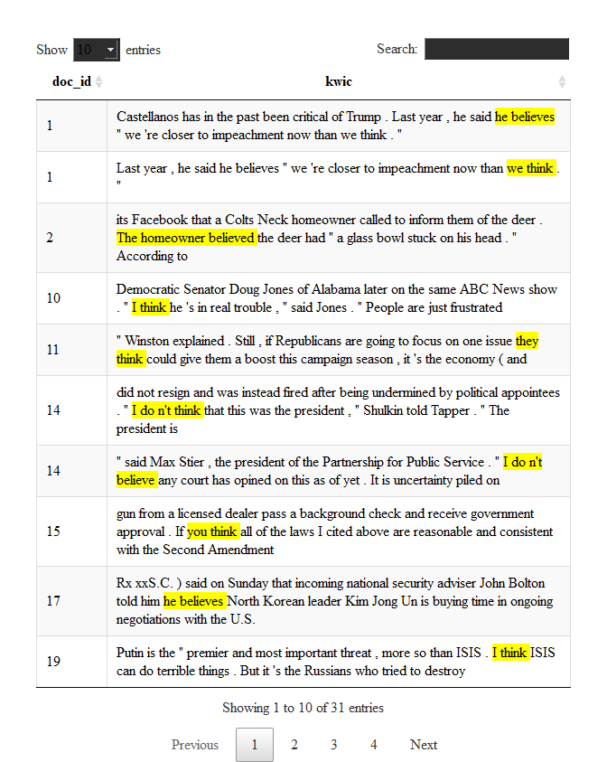

corpuslingr
===========

The main function of this library is to enable complex search of an annotated corpus akin to search functionality made available via `RegexpParser` in Python's Natural Language Toolkit (NLTK). While regex-based, search syntax has been simplified, and modeled after the more intuitive syntax used in the online BYU suite of corpora.

Summary functions allow users to aggregate search results by text & token frequency, view search results in context (kwic), and create word embeddings/co-occurrence vectors for each search term. Functions also allow users to specify how search results are aggregated. Importantly, search and aggregation functions can be easily applied to multiple (ie, any number of) search queries.

The collection of functions presented here is ideal for usage-based linguists and digital humanists interested in fine-grained search of moderately-sized corpora.

``` r
library(tidyverse)
library(cleanNLP)
library(corpuslingr) #devtools::install_github("jaytimm/corpuslingr")
library(quicknews) #devtools::install_github("jaytimm/quicknews")
library(DT)
```

------------------------------------------------------------------------

Here, we walk through a simple workflow from corpus creation using `quicknews`, corpus annotation using the `cleanNLP` package, and annotated corpus search using `corpuslingr`.

------------------------------------------------------------------------

Corpus preparation & annotation
-------------------------------

To demo the search functionality of `corpuslingr`, we first build a small corpus of current news articles using my `quicknews` package. We apply the `gnews_get_meta`/`gnews_scrape_web` functions across multiple Google News sections to build out the corpus some, and to add a genre-like dimension to the corpus.

``` r
topics <- c('nation','world', 'sports')

corpus <- lapply(topics, function (x) {
    quicknews::qnews_get_meta (language="en", country="us", type="topic", search=x)%>%
    quicknews::qnews_scrape_web (link_var='link')})%>%
  bind_rows() %>%
  mutate(doc_id = as.character(row_number())) #Add doc_id
```

------------------------------------------------------------------------

### clr\_prep\_corpus

This function performs two tasks. It elminates unnecessary whitespace from the text column of a corpus dataframe object. Additionally, it attempts to trick annotators into treating hyphenated words as a single token. With the exception of Stanford's CoreNLP (via `cleanNLP`), annotators tend to treat hyphenated words as multiple word tokens. For linguists interested in word formation processes, eg, this is disappointing. There is likley a less hacky way to do this.

``` r
corpus <- clr_prep_corpus (corpus, hyphenate = TRUE)
```

------------------------------------------------------------------------

### Annotate via cleanNLP and udpipe

For demo purposes, we use `udpipe` (via `cleanNLP`) to annotate the corpus dataframe object.

``` r
cleanNLP::cnlp_init_udpipe(model_name="english",feature_flag = FALSE, parser = "none") 
ann_corpus <- cleanNLP::cnlp_annotate(corpus$text, as_strings = TRUE, doc_ids = corpus$doc_id) 
```

------------------------------------------------------------------------

### clr\_set\_corpus()

This function prepares the annotated corpus for complex, tuple-based search. Tuples are created, taking the form `<token~lemma~pos>`; tuple onsets/offsets are also set.

Annotation output is homogenized, including column names. Naming conventions established in the `spacyr` package are adopted here.

Lastly, the function splits the corpus into a list of dataframes by document. This is ultimately a search convenience.

``` r
lingr_corpus <- ann_corpus$token %>%
  clr_set_corpus(doc_var='id', 
                  token_var='word', 
                  lemma_var='lemma', 
                  tag_var='pos', 
                  pos_var='upos',
                  sentence_var='sid',
                  meta = corpus[,c('doc_id','source','search')])
```

------------------------------------------------------------------------

### clr\_desc\_corpus()

A simple function for describing an annotated corpus, providing some basic aggregate statisitcs at the corpus, genre, and text levels.

``` r
summary <- corpuslingr::clr_desc_corpus(lingr_corpus,doc="doc_id", 
                        sent="sentence_id", tok="token",upos='pos', genre="search")
```

-   **Corpus summary:**

``` r
summary$corpus
##    n_docs textLength textType textSent
## 1:     55      41725     6584     2101
```

-   **By genre:**

``` r
summary$genre
##          search n_docs textLength textType textSent
## 1: topic_nation     17      12909     2976      719
## 2:  topic_world     19      11843     3076      590
## 3: topic_sports     19      16973     2830      838
```

-   **By text:**

``` r
head(summary$text)
##    doc_id textLength textType textSent
## 1:      1        346      184       18
## 2:      2        255      143       14
## 3:      3        914      367       40
## 4:      4        330      201       17
## 5:      5        431      223       22
## 6:      6        552      265       23
```

------------------------------------------------------------------------

Search & aggregation functions
------------------------------

### Basic search syntax

The search syntax utilized here is modeled after the syntax implemented in the [BYU suite of corpora](https://corpus.byu.edu/). A full list of part-of-speech syntax can be viewed [here](https://github.com/jaytimm/corpuslingr/blob/master/data-raw/clr_ref_pos_syntax.csv).

``` r
library(knitr)
corpuslingr::clr_ref_search_egs %>% kable(escape=FALSE, format = "html")
```

<table>
<thead>
<tr>
<th style="text-align:left;">
type
</th>
<th style="text-align:left;">
search\_syntax
</th>
<th style="text-align:left;">
example
</th>
</tr>
</thead>
<tbody>
<tr>
<td style="text-align:left;">
Simple form search
</td>
<td style="text-align:left;">
lime
</td>
<td style="text-align:left;">
lime
</td>
</tr>
<tr>
<td style="text-align:left;">
Simple lemma search
</td>
<td style="text-align:left;">
DRINK
</td>
<td style="text-align:left;">
drinks, drank, drinking
</td>
</tr>
<tr>
<td style="text-align:left;">
Lemma with POS search
</td>
<td style="text-align:left;">
BARK~VERB
</td>
<td style="text-align:left;">
barked, barking
</td>
</tr>
<tr>
<td style="text-align:left;">
Simple phrasal search
</td>
<td style="text-align:left;">
in the long run
</td>
<td style="text-align:left;">
in the long run
</td>
</tr>
<tr>
<td style="text-align:left;">
Phrasal search - POS/form
</td>
<td style="text-align:left;">
ADJ and ADJ
</td>
<td style="text-align:left;">
happy and healthy, political and economical
</td>
</tr>
<tr>
<td style="text-align:left;">
Phrasal search inc noun phrase
</td>
<td style="text-align:left;">
VERB NPHR into VBG
</td>
<td style="text-align:left;">
trick someone into believing
</td>
</tr>
<tr>
<td style="text-align:left;">
Phrasal search inc noun phrase
</td>
<td style="text-align:left;">
VERB PRP$ way PREP NPHR
</td>
<td style="text-align:left;">
make its way through the Senate
</td>
</tr>
<tr>
<td style="text-align:left;">
Suffix search
</td>
<td style="text-align:left;">
\*tion
</td>
<td style="text-align:left;">
defenestration, nation, retaliation
</td>
</tr>
<tr>
<td style="text-align:left;">
Infix search
</td>
<td style="text-align:left;">
\*break\*
</td>
<td style="text-align:left;">
breakable, heartbreaking
</td>
</tr>
<tr>
<td style="text-align:left;">
Optional search w/ parens and ?
</td>
<td style="text-align:left;">
MD (NEG)? HAVE been
</td>
<td style="text-align:left;">
should have been, might not have been
</td>
</tr>
<tr>
<td style="text-align:left;">
Multiple term search w parens and |
</td>
<td style="text-align:left;">
PRON (HOPE| WISH| DESIRE)
</td>
<td style="text-align:left;">
He hoped, they wish
</td>
</tr>
<tr>
<td style="text-align:left;">
Multiple term search w parens and |
</td>
<td style="text-align:left;">
House (Republicans| Democrats)
</td>
<td style="text-align:left;">
House Republicans, House Democrats
</td>
</tr>
<tr>
<td style="text-align:left;">
Indeterminate wildcard search w brackets and min/max
</td>
<td style="text-align:left;">
NPHR BE \*{1,4} ADJ
</td>
<td style="text-align:left;">
He was very, very happy; I'm not sure
</td>
</tr>
</tbody>
</table>

------------------------------------------------------------------------

### clr\_search\_gramx()

Search for all instantiaions of a particular lexical pattern/grammatical construction devoid of context. This function enables fairly quick search.

``` r
search1 <- "VERB (PRON)? (PREP| RP)"

lingr_corpus %>%
  corpuslingr::clr_search_gramx(search=search1)%>%
  slice(1:10)
## # A tibble: 10 x 4
##    doc_id token            tag    lemma          
##    <chr>  <chr>            <chr>  <chr>          
##  1 1      spitting in      VBG IN spitt in       
##  2 1      terminated after VBN IN terminate after
##  3 1      Facebook on      VB IN  Facebook on    
##  4 1      escalates with   VBZ IN escalate with  
##  5 1      climb over       VB IN  climb over     
##  6 1      started because  VBD IN start because  
##  7 1      be at            VB IN  be at          
##  8 1      comment on       VB IN  comment on     
##  9 1      published on     VBN IN publish on     
## 10 1      saddened by      VBN IN sadden by
```

------------------------------------------------------------------------

### clr\_get\_freq()

A simple function for calculating text and token frequencies of search term(s). The `agg_var` parameter allows the user to specify how frequency counts are aggregated.

Note that generic noun phrases can be include as a search term (regex below), and can be specified in the query using `NPHR`.

``` r
clr_ref_nounphrase
## [1] "(?:(?:DET )?(?:ADJ )*)?(?:((NOUNX )+|PRON ))"
```

``` r
search2 <- "*tial NOUNX"

lingr_corpus %>%
  corpuslingr::clr_search_gramx(search=search2)%>%
  corpuslingr::clr_get_freq(agg_var = 'token', toupper=TRUE)%>%
  head()
##                     token txtf docf
## 1:  PRESIDENTIAL ELECTION    5    3
## 2:    PRESIDENTIAL PALACE    4    2
## 3: PRESIDENTIAL ELECTIONS    3    1
## 4:   INITIAL APPOINTMENTS    1    1
## 5:         MARTIAL ARTIST    1    1
## 6:       POTENTIAL MOTIVE    1    1
```

------------------------------------------------------------------------

### clr\_search\_context()

A function that returns search terms with user-specified left and right contexts (`LW` and `RW`). Output includes a list of two dataframes: a `BOW` (bag-of-words) dataframe object and a `KWIC` (keyword in context) dataframe object.

``` r
search3 <- 'NPHR (DO)? (NEG)? (THINK| BELIEVE )'

found_egs <- corpuslingr::clr_search_context(search=search3,corp=lingr_corpus,LW=5, RW = 5)
```

------------------------------------------------------------------------

### clr\_context\_kwic()

Access `KWIC` object:

``` r
found_egs %>%
  corpuslingr::clr_context_kwic()%>% #Add genre.
  select(doc_id,kwic)%>%
  slice(1:15)%>%
  DT::datatable(selection="none",class = 'cell-border stripe', rownames = FALSE,width="100%", escape=FALSE)
```



------------------------------------------------------------------------

### clr\_context\_bow()

A function for accessing `BOW` object. The parameters `agg_var` and `content_only` can be used to specify how collocates are aggreggated and whether only content words are included, respectively.

``` r
search3 <- "White House"

corpuslingr::clr_search_context(search=search3,corp=lingr_corpus,LW=10, RW = 10)%>%
  corpuslingr::clr_context_bow(content_only=TRUE,agg_var=c('searchLemma','lemma'))%>%
  head()
##    searchLemma     lemma cofreq
## 1: WHITE HOUSE     TRUMP      7
## 2: WHITE HOUSE     COVER      5
## 3: WHITE HOUSE PRESIDENT      5
## 4: WHITE HOUSE STATEMENT      4
## 5: WHITE HOUSE    FOLLOW      3
## 6: WHITE HOUSE  NATIONAL      3
```

------------------------------------------------------------------------

### clr\_search\_keyphrases()

Function for extracting key phrases from each text comprising a corpus based on tf-idf weights. The methods and logic underlying this function are described in more detail [here](https://www.jtimm.net/blog/keyphrase-extraction-from-a-corpus-of-texts/).

The regex for key phrase search:

``` r
clr_ref_keyphrase
## [1] "(ADJ )*(NOUNX )+((PREP )(ADJ )*(NOUNX )+)?"
```

The user can specify the number of keyphrases to extract, how to aggregate key phrases, how to output key phrases, and whether or not to use jitter to break ties among top n key phrases.

``` r
lingr_corpus %>%
  corpuslingr::clr_search_keyphrases(n=5, key_var ='lemma', flatten=TRUE,jitter=TRUE)%>%
  head()%>%
  kable(escape=FALSE, format = "html")
```

<table>
<thead>
<tr>
<th style="text-align:left;">
doc\_id
</th>
<th style="text-align:left;">
keyphrases
</th>
</tr>
</thead>
<tbody>
<tr>
<td style="text-align:left;">
1
</td>
<td style="text-align:left;">
customer | altercation | video | sandwich | owner
</td>
</tr>
<tr>
<td style="text-align:left;">
2
</td>
<td style="text-align:left;">
boy | police | attacker | year-old boy | train
</td>
</tr>
<tr>
<td style="text-align:left;">
3
</td>
<td style="text-align:left;">
Sharps | family | family member | Sharp family | Amy Sharp
</td>
</tr>
<tr>
<td style="text-align:left;">
4
</td>
<td style="text-align:left;">
NRA | accident | trip | problem | involvement in nationwide shooting competition
</td>
</tr>
<tr>
<td style="text-align:left;">
5
</td>
<td style="text-align:left;">
Moss | temperature | Durham | roads | drizzle
</td>
</tr>
<tr>
<td style="text-align:left;">
6
</td>
<td style="text-align:left;">
wall | military | drug | national defense | Trump
</td>
</tr>
</tbody>
</table>
